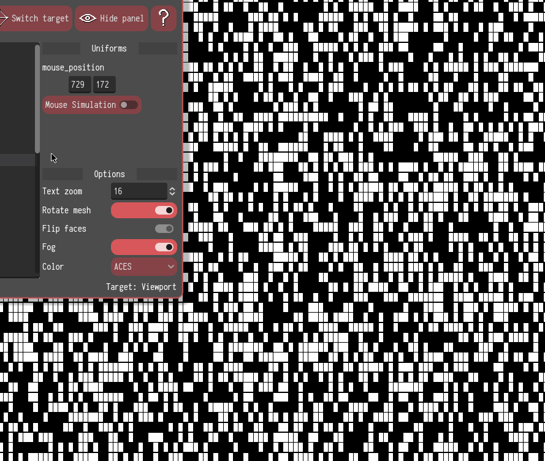
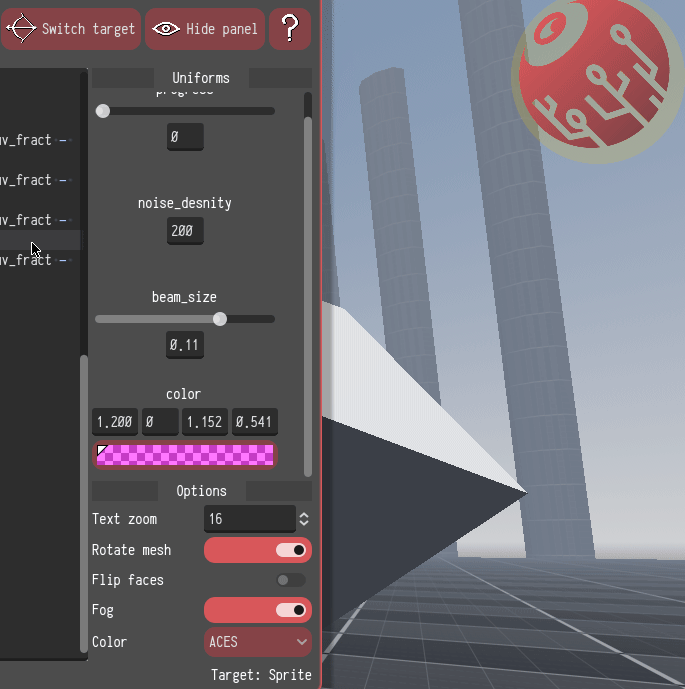

# What is this about

Godot Shaders Sketchbook is a little sandbox for quick prototyping Godot shaders. You can write, test and iterate your own code without distractions, or maybe you might want to play around with code <a href="https://godotshaders.com/">from the communty</a>​ before testing on production.

## Features

* Compact live coding environment with error status bar

* Full syntax highlighting (Godot 4 shading language)

* Hot swapping between common targets:
    * Sprite and viewport (for canvas_item shaders)
    * Cube and "cam filter" mesh (for spatial shaders)

* Widgets for the most common uniform datatypes:
    * Color picker for vec3 and vec4
    * Mouse input simulation for vec2
    * Sliders for int, float
    * Preloaded data for sampler2D

## Showcase

The tool can be tried on the <a href="http://horologiq.itch.io/godot-shaders-sketchbook">browser directly</a>, however downloading the desktop application is highly recommended.

Error handling

Vec3 widget with color picker

Vec2 widget with mouse simulation

Float widget and target how swapping

## License

GSS is written by P.Cervantes (Horologiq) and licensed as Free Software under the MIT license
